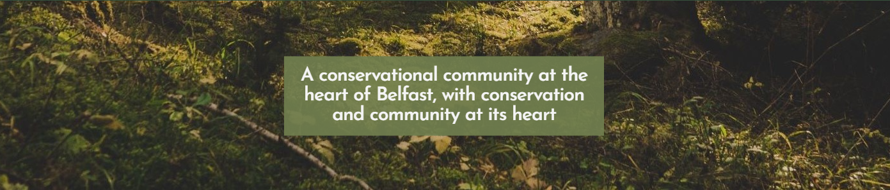
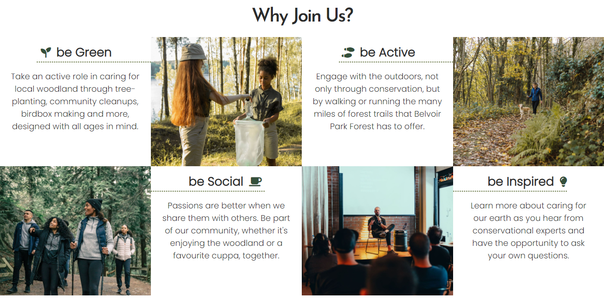
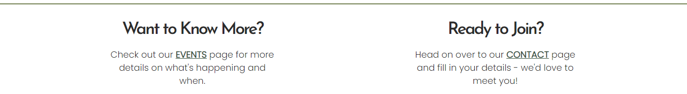
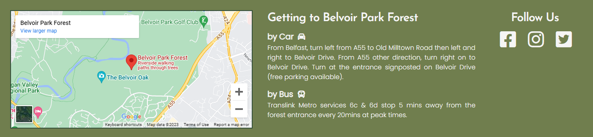
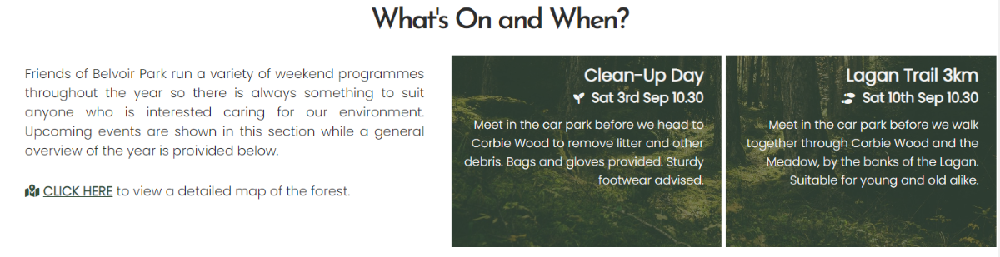
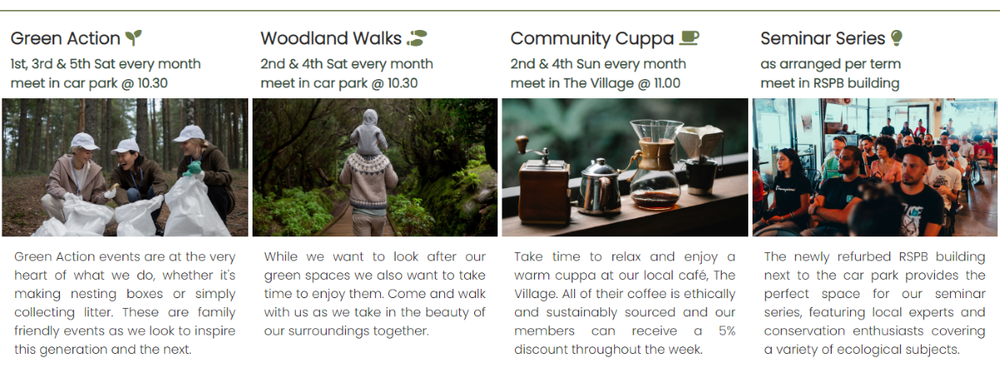
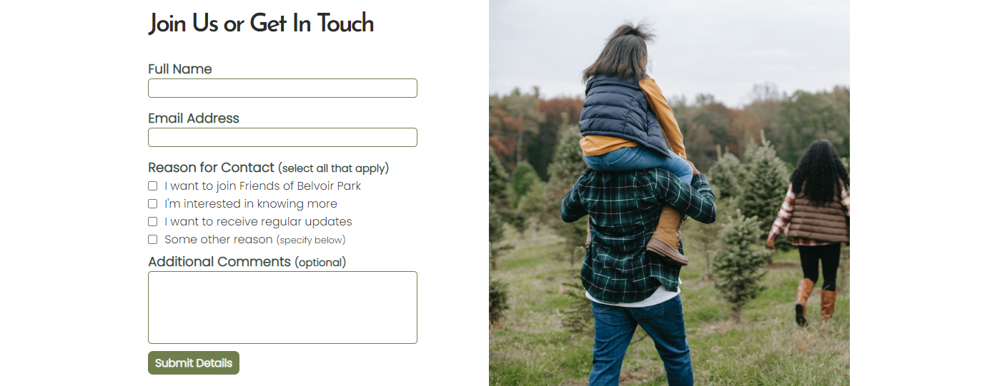

# Friends of Belvoir Park

Belvoir Park Forest is an large area of woodland the southern suburbs of Belfast; this website seeks to create an online presence for *Friends of Belvoir Park*, an imagined local conservation group based in and around this area of Belfast.

The main aims of the site are as follows:
- to provide an appealing online presence for the group that encourages users to find out more
- to provide general info on Friends of Belvoir Park and their activities
- to provide specific time/date information of events organised by the group
- to provide an convenient means of contacting the group

## Initial Development

Three user stories were created at the outset of this project to guide its initial design and provide goals for the finished project:
- User A: as someone who is a resident of the local area, I want to know more about *Friends of Belvoir Park* (*FBP*) so I can decide if its something I want to be a part of.
- User B: as someone who is aware of *FBP* but only at a basic level, I want to find out what specific events *FBP* run and when they're happening so I can decide what to take part in.
- User C: as someone who is passionate about green spaces and caring for the environment, I would like to join *FBP* so I can take an active role in a ‘green community’.

The intial design ideas were developed using the interactive prototyping site [Uizard.io](https://app.uizard.io/p/517cac80)

## Features 

### Existing Features

- __Title & Navigation Bar__

  - Featured on all three pages, the title and navigation elements are placed top and centre to allow for a coherent design across the site and a convenient location to access the Home, Events and Contact pages.
  - This section will allow the user to easily navigate from page to page across all devices without having to revert back to the previous page via the ‘back’ button. 

- __Hero Image__

  - The landing page includes animated photograph and text overlay to highlight the main seeting and ethos of 'Friends of Belvoir Park'. 
  - The pan-down animation of the image draws the user's eye downwards so they will continur reading into the next section
  - The fade-in animation of the text draws attention to the ethos of the group

- __*Why Join Us?* Section__

  - This section will give the user more information as to what the group does and the spectrum of activities covered. 
  - The images and icons alongside each section provide visual metaphors for the user and and further encouragement to join the group.

- __Continue Exploring section__

  - This section provides links to the other pages, encouraging the user to remain active on the site.
  - It provides a convenient continuation to their journey without having to scroll back up to the Navigation Bar.

- __The Footer__ 

  - The footer section includes a map and directions to Belvoir Park Forest as well as links to the group's social media sites.
  - The footer provides valuable information to the user by means of showing exactly where the group meets and how to get there. 
  - The footer also encourages the user to keep connected and become part of the community via social media.

- __Events Page - Top__

  - This section of the page is valuable to the user as it highlights the most immediate and specific events taking place.
  - This section also provides the user with a link to the forest map so they can identified specific locations mentioned.
  - The specific events highlighted will be updated to keep them up-to-date and relevant for the user.

- __Events Page - Bottom__

  - This section of the page is valuable to the user in giving a more general overview of each month's activities.
  - As with the *Why Join Us?* section, relevant images and icons provide cues and a more visually appealing experince for the user.
  - The icons used are consistent with those in the *Why Join Us?* section to provide coherence of theme and message.

- __Contact Page__

  - This page will allow the user to provide personal details in order to become a member of Friends of Belvoir Park.
  - This page also allows the member to gain more information about the group.
  - The checkboxes allow them to specify which information they would like to recieve from the group.
  - An 'Additional Comments' textbox allows the user to provide specific questions/requests to the group.

### Features to Implement

The following are ideas which can be implemented into the site at a later time:
- Add pages to show photos from events
- Add
- Reformat contact form to load message within iframe

## Testing 

In this section, you need to convince the assessor that you have conducted enough testing to legitimately believe that the site works well. Essentially, in this part you will want to go over all of your project’s features and ensure that they all work as intended, with the project providing an easy and straightforward way for the users to achieve their goals.

In addition, you should mention in this section how your project looks and works on different browsers and screen sizes.

You should also mention in this section any interesting bugs or problems you discovered during your testing, even if you haven't addressed them yet.

If this section grows too long, you may want to split it off into a separate file and link to it from here.

### Validator Testing 

- HTML: No errors were returned when passing each HTML page through the official W3C HTML validator
  - [index.html](https://validator.w3.org/nu/?doc=https%3A%2F%2Fndsurgenor.github.io%2Ffriends-of-belvoir-park%2Findex.html)
  - [events.html](https://validator.w3.org/nu/?doc=https%3A%2F%2Fndsurgenor.github.io%2Ffriends-of-belvoir-park%2Fevents.html)
  - [contact.html](https://validator.w3.org/nu/?doc=https%3A%2F%2Fndsurgenor.github.io%2Ffriends-of-belvoir-park%2Fcontact.html)
- CSS: No errors were found when passing style.css through the official [W3C CSS Validator](https://jigsaw.w3.org/css-validator/validator?uri=https%3A%2F%2Fndsurgenor.github.io%2Ffriends-of-belvoir-park%2F&profile=css3svg&usermedium=all&warning=1&vextwarning=&lang=en)

### Unfixed Bugs

You will need to mention unfixed bugs and why they were not fixed. This section should include shortcomings of the frameworks or technologies used. Although time can be a big variable to consider, paucity of time and difficulty understanding implementation is not a valid reason to leave bugs unfixed. 

## Deployment

The live link can be found here - https://ndsurgenor.github.io/friends-of-belvoir-park 

- The site was deployed to GitHub pages. The steps to deploy are as follows: 
  - In the GitHub repository, navigate to the Settings tab (top right)
  - From the options in the lefthand side menu, select GitHub pages
  - From the source section drop-down menu, select the Master Branch
  - Once the master branch has been selected, the page will be automatically refreshed with a detailed ribbon display to indicate the successful deployment.

## Credits 

### Content 

- The icons throughout the site were taken from [Font Awesome](https://fontawesome.com/)
- Instructions on how to correctly position text over the hero image were taken from a question on [Stack Overflow](https://stackoverflow.com/questions/34739570/hero-image-text-overlay-moves-around-on-browser-resize)
- The map in the footer is displayed using adapted embed code from [Google Maps](https://goo.gl/maps/7sfANXM9UZmFgrss6)
  and this link was shortened using [TinyURL](https://tinyurl.com/app)
- The map on the Events page is produced and distrubuted by [NI Direct](https://www.nidirect.gov.uk/publications/northern-ireland-public-forests-trail-maps)
- README.md file adapted from the Code Institute README.md template

### Media

- The photos used throughout the site were taken from [Pexels](https://pexels.com); specifically, the following photographers should be credited:
  - Any Lane: [family.jpg](https://www.pexels.com/photo/family-visiting-tree-farm-and-walking-among-pines-5728297/)
  - Ekaterina Bolovtsova: [be-green.jpg](https://www.pexels.com/photo/scouts-collecting-rubbish-in-a-forest-5036781/)
  - Humphrey Muleba: [be-active.jpg](https://www.pexels.com/photo/woman-and-dog-walking-at-woods-1612847/)
  - Matheus Bertelli: [be-inspired.jpg](https://www.pexels.com/photo/photo-of-man-sitting-in-front-3321796/)
      & [event-inspired.jpg](https://www.pexels.com/photo/photo-of-people-sitting-on-chairs-3321789/)
  - Michael Burrows: [event-social.jpg](https://www.pexels.com/photo/chemex-coffeemaker-with-cup-placed-on-terrace-with-metal-kettle-and-hand-grinder-7125621/)
  - PNW Production: [be-social.jpg](https://www.pexels.com/photo/people-hiking-in-a-forest-7624986/)
  - Ron Lack: [event-green.jpg](https://www.pexels.com/photo/happy-woman-doing-an-environmental-cleanup-9543745/)
  - Tatiana Syrikova: [event-active.jpg](https://www.pexels.com/photo/anonymous-man-with-baby-on-shoulders-walking-away-3932687/)
  - Tobias Aeppli: [hero-image.jpg](https://www.pexels.com/photo/trees-1125265/)